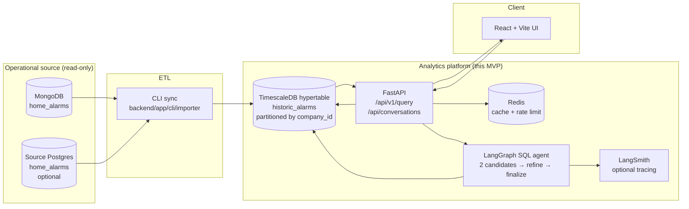
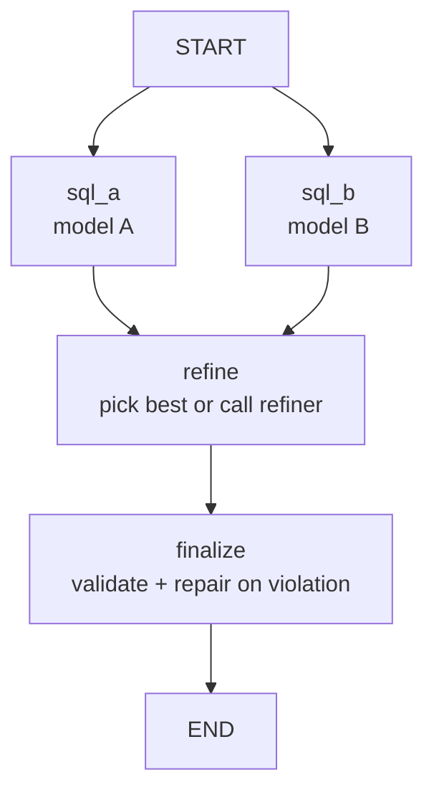
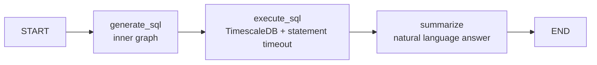

# Architecture

This document describes the end-to-end data flow and component layout of the Seon History agent. It is intended for reviewers, future contributors, and graders evaluating the system as a whole.

---

## System view



The architecture deliberately separates the **operational** plane (where the live alarm-monitoring app writes to MongoDB) from the **analytics** plane (where the AI agent reads from TimescaleDB). The agent never touches the production Mongo cluster directly.

---

## Why Mongo → Postgres

This is the single most important architectural decision in the project, and it is not arbitrary.

| Concern | MongoDB (operational) | TimescaleDB (analytical) |
|---|---|---|
| Designed for | Per-record dispatch writes, low-latency lookups by alarm ID | Time-series scans, aggregations across millions of rows |
| Multi-tenant scoping | Application-level filter | First-class space-partitioning by `company_id` |
| Time-range queries | Slow without secondary indexes | Native via hypertable chunks + retention policies |
| `GROUP BY` / window functions | Possible via aggregation pipeline, awkward | Idiomatic SQL, the LLM has decades of training data on it |
| Cost of a runaway analytical query | Can degrade live dispatch | Isolated environment, statement timeouts |

Pointing an LLM at the production MongoDB would have been **dangerous on three axes**: (1) unbounded queries could degrade live dispatch latency, (2) the Mongo aggregation pipeline is awkward enough that LLM hallucinations are more likely, (3) GPT-class models have orders of magnitude more SQL training data than Mongo aggregation training data, so SQL is the higher-quality target language.

The ETL pipeline (`backend/app/cli/importer/`) handles the impedance mismatch:

- Pulls in batches (default 1000 records, 100-row inserts) on a 5-second loop.
- Maintains an `import_cursor` table so the sync is resumable.
- Maps Mongo documents to typed Postgres columns (`backend/app/cli/importer/transform.py`).
- Validates each record before insert (`validation.py`).

The result is a clean, queryable, time-partitioned analytics dataset. As of writing, the local instance holds **2.4M alarms across 7 companies, spanning 2018-07 to 2026-04** — real Seon-scale data.

---

## TimescaleDB hypertable layout

```sql
SELECT create_hypertable(
  'historic_alarms',
  'created_at',                    -- time dimension
  partitioning_column => 'company_id',
  number_partitions   => 8,         -- space dimension
  chunk_time_interval => INTERVAL '1 month'
);
SELECT add_retention_policy('historic_alarms', INTERVAL '180 days');
```

- **Time partitioning on `created_at`** gives chunked storage and prunes old data efficiently.
- **Space partitioning on `company_id`** keeps each tenant's data in physically separate chunks. This is a performance win *and* a defence-in-depth against cross-tenant queries — even an accidentally unconstrained scan touches fewer tenants.
- **Retention 180 days** caps storage cost and limits the blast radius of any data leak.

Indexes are tuned for the dominant query shape — `WHERE company_id = ? AND alarm_creation_at BETWEEN ? AND ?`:

```
idx_historic_alarms_company_alarm_creation  (company_id, alarm_creation_at DESC)
idx_historic_alarms_company_time            (company_id, created_at)
```

Compression and continuous aggregates are documented in the README as planned future work.

---

## Request lifecycle

A single user question travels through the system as follows:

1. **Browser** posts to `POST /api/v1/query` with `{question}` body, `X-Company-Id` and `X-API-Key` headers.
2. **FastAPI middleware** authenticates via `X-API-Key`, applies IP rate limiting via Redis (configurable, default 10 req/window).
3. **Cache check** — Redis lookup keyed by `(company_id, question)`. Hit → return cached envelope (zero LLM tokens).
4. **LangGraph SQL graph** runs (see next section).
5. **Sanitiser** rewrites the SQL to ensure `company_id` scoping and `LIMIT 100` for non-aggregate queries.
6. **Validator** rejects any SQL that is not a single safe `SELECT`. Failure → safe error path.
7. **Executor** runs the SQL with a `statement_timeout` against TimescaleDB.
8. **Summariser** generates a natural-language answer in the question's language. For result sets larger than the row threshold, the summariser is skipped and CSV is returned directly (cost control).
9. **Cache write** — successful envelope written back to Redis.
10. **Response** — `{answer, chart_data, table_records, csv_inline, error, meta}` envelope returned to the UI. `meta` includes route, generated SQL, reasoning steps, and per-call usage/cost.
11. **Audit** — query persisted to `query_logs`; conversation messages persist `usage_meta`.

---

## LangGraph SQL agent

The agent is two compiled `StateGraph`s composed together.

### Inner graph: SQL generation with parallel candidates



- `sql_a` and `sql_b` run **in parallel** with two different OpenAI models (configurable via `OPENAI_CHAT_MODEL_A` / `OPENAI_CHAT_MODEL_B`). Different temperature / model means different failure modes. Disagreement is a useful signal.
- `refine` — if both candidates pass cheap structural checks and agree, picks one; otherwise calls a refiner model with both candidates in the prompt and asks it to choose or rewrite.
- `finalize` — runs the chosen SQL through the deterministic violation list (forbidden patterns, JSONB extraction on the empty `data` column, missing `company_id`). On violation, calls a repair LLM with the violation list; otherwise passes through unchanged.

### Outer graph: end-to-end query pipeline



The two graphs share a typed state (`SqlGraphState`, `QueryGraphState`) so the inner SQL artefacts (candidates, violations, model usage) are observable from the outer pipeline.

### Why two graphs instead of one?

The inner graph is the unit of *correctness* (produce safe SQL). The outer graph is the unit of *flow* (run it, summarise it). Splitting them means the SQL graph can be unit-tested in isolation against generation goals (does it produce safe SQL?), while the outer graph is tested for orchestration (does it return the right envelope shape?). It also makes future variants easier — e.g. swapping a different SQL strategy without touching execution/summarisation.

---

## Component map

| Layer | File / module | Responsibility |
|---|---|---|
| HTTP | `backend/app/main.py` | FastAPI bootstrap, middleware, router registration |
| HTTP | `backend/app/api/chat.py` | `/api/chat/query` (legacy) + `/api/v1/query` (envelope), rate-limit + cache |
| HTTP | `backend/app/api/conversations.py` | Conversation CRUD + message append |
| Agent | `backend/app/services/sql_generator.py` | LangGraph definition, node implementations, cost tracking |
| Agent | `backend/app/services/sql_generator_prompts.py` | All system prompts (SQL gen, refine, repair, summarise) |
| Agent | `backend/app/services/openai_client.py` | `ChatOpenAI` factory with cached instances; LangSmith env bootstrap |
| Agent | `backend/app/services/lc_prompt.py` | LangChain message + `ChatPromptTemplate` builders |
| Agent | `backend/app/services/response_generator.py` | Natural-language summarisation + chart payload selection |
| Agent | `backend/app/services/title_generator.py` | Conversation title from first message |
| Safety | `backend/app/services/sql_validator.py` | `is_safe_sql` + `sanitize_sql` (`company_id` injection) |
| Data | `backend/app/services/query_executor.py` | SQLAlchemy execution with `statement_timeout` |
| Data | `backend/app/models.py` | ORM models (`HistoricAlarm`, `Conversation`, `Message`, `QueryLog`, `ImportCursor`) |
| ETL | `backend/app/cli/importer/` | Mongo + Postgres source ingestion, cursor management |
| Cache | `backend/app/redis_client.py` | Result cache + rate limit |
| Migrations | `backend/alembic/versions/` | Schema + hypertable + retention setup |
| UI | `frontend/src/components/ChatView.jsx` | Single-shot query view, table/chart/CSV rendering |
| UI | `frontend/src/components/ConversationsView.jsx` | Threaded chat view with SQL inspection |
| UI | `frontend/src/api.js` | REST client |

---

## Observability

- **`query_logs`** — every executed query (question + SQL + result count + execution time + timestamp).
- **`messages.usage_meta`** — per-conversation-message LLM usage (tokens, cost, model, latency).
- **LangSmith** (optional) — full graph trace including parallel candidates and refiner output. Enabled by `LANGSMITH_TRACING=true`.
- **Health endpoint** — `GET /health` returns API + DB status.

The `meta.reasoning_steps` field returned to the client is a stable, auditable list of LangGraph node executions. It is **not** raw chain-of-thought; we deliberately do not return model thinking tokens.

---

## What is intentionally absent

These are deliberate non-features, not gaps:

- **Vector search / embeddings.** The schema is small enough that static schema injection works better than RAG. See [`DESIGN_DECISIONS.md`](DESIGN_DECISIONS.md).
- **Public deployment.** This is an internal B2B tool, not a public service. The production path is a Seon-tenanted deployment for customer companies via an enterprise OpenAI / Azure OpenAI contract (or optional self-hosted Ollama). See [`ETHICS.md`](ETHICS.md).
- **Write capability.** The system is read-only by construction — single-`SELECT` enforcement is a hard constraint, not a configurable policy.
